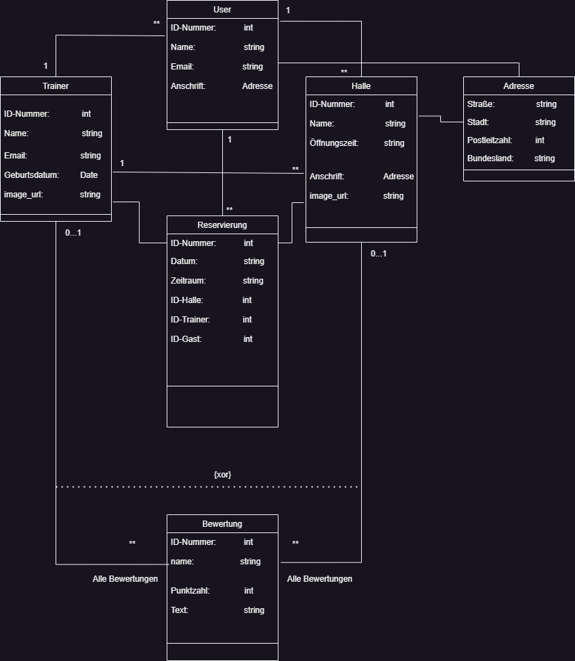
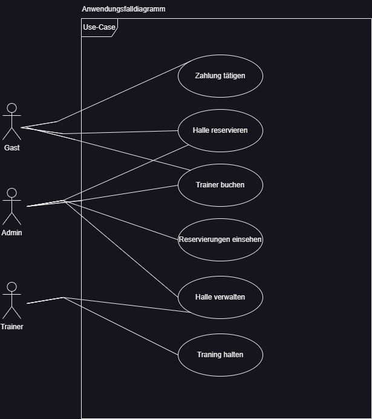
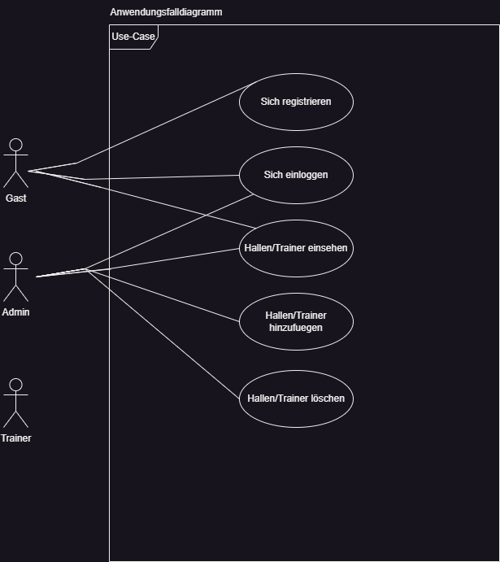

# **AGWI-PROJEKT: Tennishallen und Trainer in der Nähe reservieren**

## **Erstelltes Klassendiagramm:**

## **Erstelltes Anwendungsfalldiagramm [ALTE VERSION]**

## **Erstelltes Anwendungsfalldiagramm [NEUE VERSION (Was wurde tatsächlich ausgearbeitet)]**

## Beschreibung des Projektes 

### Ziel des Projektes 

#### *User kann ueber die Webseite/App Tennishallen in seiner Nähe einsehen.[Wurde nicht ausgearbeitet]*
#### *Außerdem kann er ausgewählte Hallen dann reservieren und einen Trainer [wenn dieser zur Verfügung steht],dazu buchen oder einfach ohne diesen in der Halle trainieren. [Wurde nicht ausgearbeitet]*
#### *Auf der Webseite sollen ihn außerdem schon bestimmte Hallen vorgeschlagen werden.[Liste an Hallen wurden Implemntiert]*
#### *User kann sich registrieren/einloggen/ausloggen [Wurde ausgearbeitet!]
#### *User kann eine Liste an Trainern einsehen[Wurde ausgearbeitet!]*
#### *Admins können auf der Seite direkt Hallen und Trainer hinzuefuegen, die dann in Datenbank gespeichert werden und in der Liste angezeigt werden![Wurde ausgearbeitet]*

# Wichtige Anmerkung

## DER ORDNER : "Flask-Webseite_F.B" enthält die Webseite erzeugt mit Flask mit den Geschäftsobjekten, app.py , html-dateien etc.

## EXTRA INSTALLATIONEN MUESSEN NORMALERWEISE NICHT GETÄTIGT WERDEN
## WENN DOCH WIRD DIES NUR IN FLASK SEIN, Importe.
## AUßERHALB DIESER UMGEBUNGEN SIND KEINE EXTRA DOWNLOADS NÖTIG!